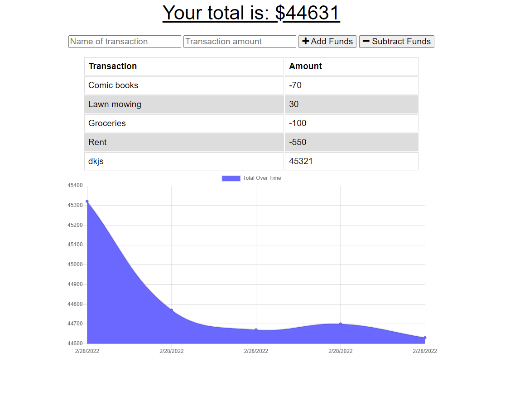

# BudgetTracker

  
  
  ## Table of Contents
  -[Project Description](#projectDescription)
  -[Table of Contents](#tableofContents)
  -[Installation](#installation)
  -[Usage](#usage)
  -[License](#license)
  -[Contributing](#contributing)
  -[Tests](#tests)
  -[Questions](#questions)

  ## Project Description 
  An application with a graph to help you keep track of your finances through a budget, and one that will still work even when the user is offline.

  
  
  
 
  ## Languages Used 
  Javascript,CSS,HTML,mongoose,mongoDB, and express.

  ### Installation Instructions
  Clone the repo, and install the needed packaged noted above using npm i.

  ### What will the app be used for? 
  This application is used to keep track of your budget on or offline.

  ### How can you contribute?
  Fork your own copy and do what you want with it!

  ### Tests 
  None

  ### Credits and Contributors 
  None

  ### License
  This application is covered under the Open license
  

  ### Questions
  -------------------------------------------------------------------------------------------------------
  
  Check me out on Github!: (https://github.com/IndiscreetGiraffe) 
  
  Any questions? Email at kikij432@gmail.com
